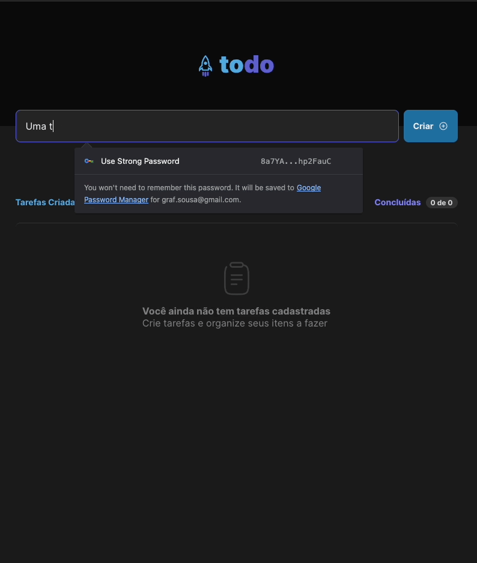

# ToDo List com React + TypeScript + Vite



:brazil:

## Descrição

Bem-vindo ao meu projeto incrível! Este é um projeto emocionante construído com Vite, uma ferramenta rápida e eficiente para desenvolvimento web.

## Principais Funcionalidades

- Cadastro de tarefas
- Conclusão de tarefas
- Exclusão de tarefas

## Pré-requisitos

Antes de começar, verifique se você atende aos seguintes requisitos:

- Node.js instalado
- npm ou Yarn instalado

## Instalação e Uso

Para instalar e usar este projeto, siga estas etapas:

1. Clone o repositório:

   ```bash
   git clone https://github.com/GrafSousa/01-fundamentos-react-to-do-list.git
   ```

2. Navegue até o diretório

   ```bash
   cd seu-projeto
   ```

3. Instale as dependências usando npm ou Yarn:

   Com npm:

   ```bash
   npm install
   ```

   Com Yarn:

   ```bash
   yarn
   ```

4. Inicie o servidor de desenvolvimento:

   Com npm:

   ```bash
   npm run dev
   ```

   Com Yarn:

   ```bash
   yarn dev
   ```

Isso iniciará o servidor de desenvolvimento Vite. Você pode acessar o seu projeto em `http://localhost:3000`.

:us:

## Description

Welcome to my amazing project! This is an exciting project built with Vite, a fast and efficient tool for web development.

## Key Features

- Task creation
- Task completion
- Task deletion

## Prerequisites

Before getting started, make sure you have the following requirements:

- Node.js installed
- npm or Yarn installed

## Installation and Usage

To install and use this project, follow these steps:

1. Clone the repository:

   ```bash
   git clone https://github.com/GrafSousa/01-fundamentos-react-to-do-list.git
   ```

2. Navigate to the directory:

   ```bash
   cd seu-projeto
   ```

3. Install dependencies using npm or Yarn:

   Using npm:

   ```bash
   npm install
   ```

   Using Yarn:

   ```bash
   yarn
   ```

4. Start the development server:

   Using npm:

   ```bash
   npm run dev
   ```

   Using Yarn:

   ```bash
   yarn dev
   ```

This will start the Vite development server. You can access your project at `http://localhost:3000`.
